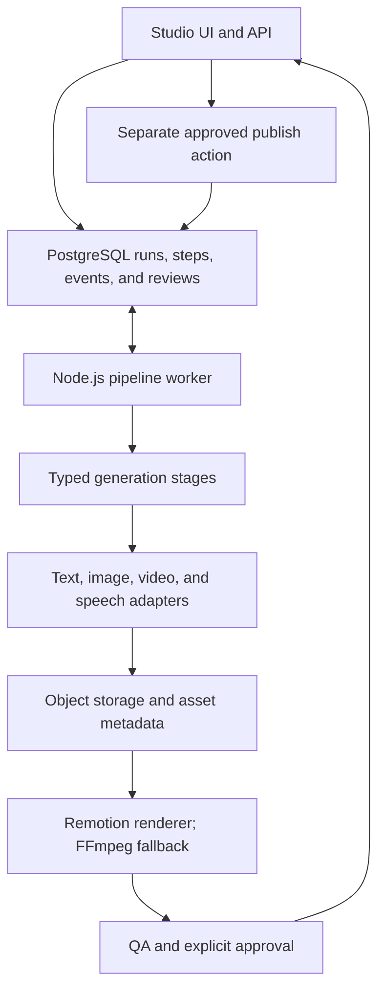

# AI Video Production Pipeline

A stateful orchestration engine for turning an idea into a reviewable video. It coordinates model calls, scene assets, narration, rendering, and approval as explicit stages, making intermediate work and failures inspectable from the Studio interface.

## Architecture

`image`, `video`, `avatar`, and `hybrid` select different stage plans. The code-first worker executes those plans directly; legacy n8n workflow exports remain available as reference/fallback orchestration, not as a hidden executor inside the worker.

## Engineering decisions

- **Persist orchestration state:** runs, steps, events, and review records live in PostgreSQL, so the UI can explain progress and failures beyond a single request/response cycle.
- **Separate providers from workflow logic:** adapter helpers handle model-specific integration while file-backed prompts and schemas define structured stage outputs.
- **Review before publishing:** generation finishes at an approval boundary. Publishing is a separate action with selected-render and account checks; opt-in intermediate reviews can pause and resume generation.
- **Use a render contract:** scene assets and narration feed a render manifest, with Remotion as the default renderer and a configured FFmpeg fallback.

## Start reading

| Source | Responsibility |
| --- | --- |
| [worker.mjs](worker.mjs) | Claim and execute queued stages |
| [runs.mjs](runs.mjs) | Stage plans, enqueue/status helpers, event state |
| [stages.mjs](stages.mjs) | Generation, render, QA, and explicit publish handlers |
| [reviews.mjs](reviews.mjs) | Review snapshots, approvals, and resumption |
| [schema.mjs](schema.mjs) | Pipeline state schema |
| [Setup](../README.md) | Local stack and configuration |
| [Architecture details](../docs/ai-context/architecture-summary.md) | Runtime boundaries and complete flow |

**Stack:** Node.js, PostgreSQL, model-provider adapters, object storage, Remotion, FFmpeg, n8n, Docker. This overview describes implementation capabilities, not benchmarked throughput or deployment scale.
